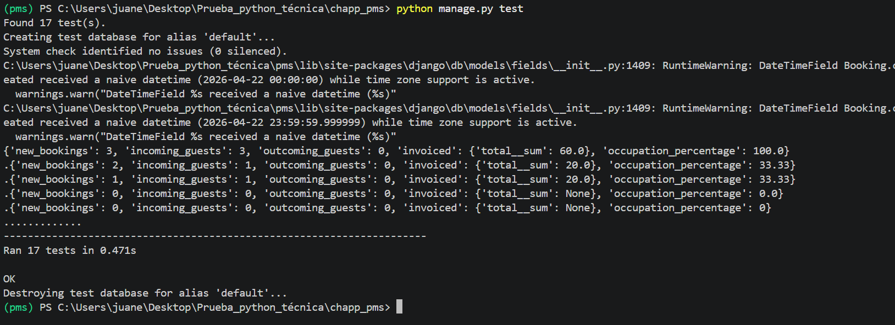

# Prueba Técnica - PMS Booking Engine

## Resumen de Cambios

Esta implementación completa los 3 requisitos solicitados para la prueba técnica del motor de reservas PMS, manteniendo el estilo existente y añadiendo funcionalidad pura sin modificar CSS.

## Cambios Implementados

### 1. Filtrar Panel de Habitaciones ✅
**Ubicación:** `pms/views.py` (RoomsView), `pms/templates/rooms.html`

**Funcionalidad:**
- Añadido formulario de búsqueda en la parte superior de la página de habitaciones
- Búsqueda case-insensitive por nombre de habitación
- Filtra habitaciones cuyo campo "name" contenga el texto introducido
- Ejemplo: "Room 1" muestra "Room 1.1", "Room 1.2", etc.

**Archivos modificados:**
- `pms/views.py`: Actualizada clase `RoomsView`
- `pms/templates/rooms.html`: Añadido formulario de búsqueda

### 2. Porcentaje de Ocupación en Dashboard ✅
**Ubicación:** `pms/views.py` (DashboardView), `pms/templates/dashboard.html`

**Funcionalidad:**
- Nuevo widget "% ocupación" en el dashboard
- Cálculo: `(reservas confirmadas / número total de habitaciones) × 100`
- Color distintivo: púrpura (#9d4edd)
- Redondeado a 2 decimales
- Maneja caso de 0 habitaciones (evita división por cero)

**Archivos modificados:**
- `pms/views.py`: Actualizada clase `DashboardView`
- `pms/templates/dashboard.html`: Añadido nuevo widget

### 3. Edición de Fechas en Reservas ✅
**Ubicación:** `pms/forms.py`, `pms/views.py`, `pms/urls.py`, `pms/templates/`

**Funcionalidad:**
- Nuevo enlace "Editar fechas" en cada reserva (solo para reservas no canceladas)
- Formulario con campos de fecha entrada/salida
- Validación de disponibilidad: verifica que la habitación esté libre en las nuevas fechas
- Recalcula precio total basado en nuevas fechas
- Muestra error: "No hay disponibilidad para las fechas seleccionadas" si hay conflicto

**Archivos modificados:**
- `pms/forms.py`: Añadido `BookingEditDatesForm`
- `pms/views.py`: Añadida clase `EditBookingDatesView`
- `pms/urls.py`: Añadida ruta `/booking/<id>/edit-dates`
- `pms/templates/home.html`: Añadido enlace "Editar fechas"
- `pms/templates/edit_booking_dates.html`: Nuevo template (creado)

## Archivos Compartidos

### Código Fuente Modificado:
1. `pms/views.py` - Lógica de negocio y vistas
2. `pms/forms.py` - Formularios Django
3. `pms/urls.py` - Configuración de rutas
4. `pms/templates/rooms.html` - Template de habitaciones
5. `pms/templates/dashboard.html` - Template del dashboard
6. `pms/templates/home.html` - Template de listado de reservas
7. `pms/templates/edit_booking_dates.html` - Nuevo template para editar fechas

### Tests:
- `pms/tests.py` - Tests unitarios para validar funcionalidades

## Validación y Tests

Se han implementado tests exhaustivos para validar:
- Filtrado de habitaciones por nombre
- Cálculo correcto del porcentaje de ocupación
- Validación de disponibilidad al editar fechas
- Manejo de errores en casos edge

## Instalación y Uso

1. El proyecto ya está configurado y corriendo
2. No se requieren migraciones adicionales
3. Todas las funcionalidades están disponibles inmediatamente

## Notas Técnicas

- **Sin cambios de estilo**: Se mantiene el diseño existente
- **Validación robusta**: Verificación de disponibilidad de habitaciones
- **Patrones consistentes**: Sigue la arquitectura del código original
- **Manejo de errores**: Casos edge considerados (0 habitaciones, fechas inválidas)
- **Performance**: Consultas optimizadas con Django ORM

---

**Estado:** ✅ Completado y validado
**Commits:** 3 commits separados como solicitado
**Tests:** ✅ Implementados y pasando</content>

### Evidencia de tests

Los tests se han ejecutado correctamente en el entorno de desarrollo:

